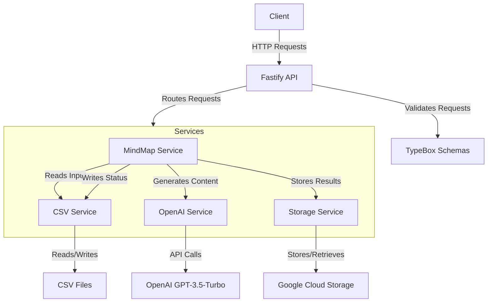
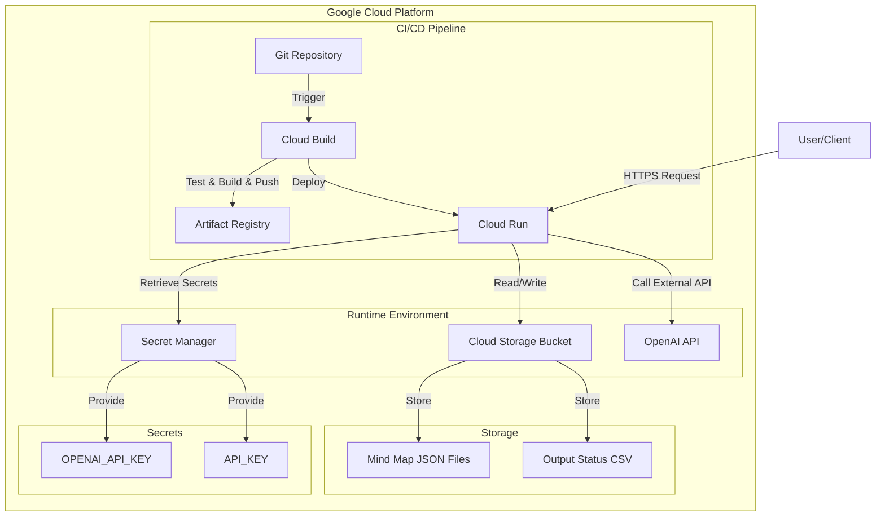
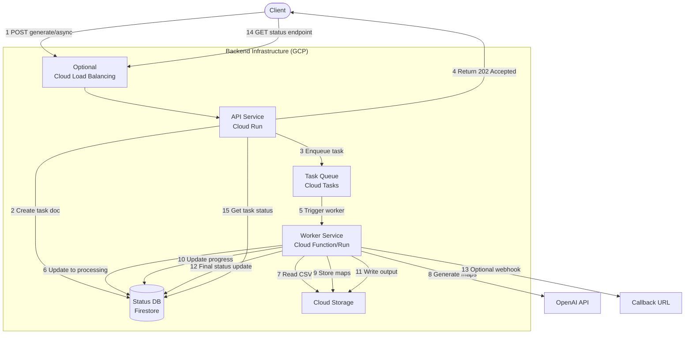

# Mind Map Generator

[](https://github.com/yourusername/mindmap-generator/actions/workflows/CI.yml)
[](https://opensource.org/licenses/MIT)
[](https://nodejs.org)
[](https://www.typescriptlang.org/)
[](https://platform.openai.com/)

An AI-powered backend service that leverages OpenAI's GPT-3.5-Turbo to dynamically generate structured mind maps from educational content, deployed on Google Cloud Platform.

## Table of Contents

- [Overview](#overview)
- [Key Features](#key-features)
- [Tech Stack](#tech-stack)
- [Architecture](#architecture)
  - [Application Architecture](#application-architecture)
  - [GCP Infrastructure](#gcp-infrastructure)
- [API Endpoints](#api-endpoints)
  - [Health Check](#1-health-check)
  - [Retrieve Mind Maps](#2-retrieve-mind-maps)
  - [Generate Mind Maps](#3-generate-mind-maps)
- [Project Structure](#project-structure)
- [Setup and Installation](#setup-and-installation)
  - [Prerequisites](#prerequisites)
  - [Environment Variables](#environment-variables)
  - [Local Installation](#local-installation)
  - [Docker Development](#docker-development)
  - [Production Deployment](#production-deployment)
- [GCP Infrastructure Setup](#gcp-infrastructure-setup)
  - [Required GCP Resources](#required-gcp-resources)
  - [Cloud Run Configuration](#cloud-run-configuration)
- [CI/CD Pipeline](#cicd-pipeline)
- [Error Handling Strategy](#error-handling-strategy)
- [Testing Strategy](#testing-strategy)
  - [Unit Tests](#unit-tests)
  - [Integration Tests](#integration-tests)
  - [Mutation Tests](#mutation-tests)
  - [Retry and Error Handling Tests](#retry-and-error-handling-tests)
- [Scaling Considerations](#scaling-considerations)
- [Future Enhancements](#future-enhancements)
- [Future Ideas](#future-ideas)
- [Monitoring and Logging](#monitoring-and-logging)
- [License](#license)

## Overview

This project is a production-ready backend service that intelligently generates mind maps for educational topics using OpenAI's GPT-3.5-Turbo API. The system processes input CSV data containing subject-topic pairs, generates corresponding mind maps via the OpenAI API, stores them securely in Google Cloud Storage, and provides a robust API for accessing and managing the generated content. The entire solution is containerized and deployed on Google Cloud Run with a fully automated CI/CD pipeline.

## Quick Start

Get the server running locally in just a few steps:

1. **Clone the repository:**

   ```bash
   git clone https://github.com/sahnas/mindmap-generator.git
   cd mindmap-generator
   ```

2. **Install dependencies:**

   ```bash
   pnpm install
   ```

3. **Configure environment variables:**

   - Copy the example environment file:

     ```bash
     cp .env.example .env
     ```

   - Edit the `.env` file and add your secrets:
     - `OPENAI_API_KEY`: Your key from OpenAI.
     - `API_KEY`: A secret key you choose to protect the API endpoints (min 8 characters).
   - For the quickest start without GCP setup, ensure `USE_LOCAL_STORAGE=true` is set in your `.env` file (this is often the default in `.env.example`).

4. **Run the development server:**

   ```bash
   pnpm run dev
   ```

5. **Access the API:**
   The API should now be running at `http://localhost:3000` (or the port specified in your `.env`). You can test the health check:

   ```bash
   curl http://localhost:3000/
   ```

For more detailed setup instructions (including Docker, production deployment, and GCP configuration), please refer to the [Setup and Installation](#setup-and-installation) section.

## Key Features

- **AI-Powered Mind Map Generation**: Transforms educational topics into structured, hierarchical mind maps using OpenAI's GPT-3.5-Turbo
- **Cloud Storage Integration**: Seamlessly stores generated mind maps in Google Cloud Storage
- **CSV Processing**: Efficiently handles input data from CSV files and outputs processing status
- **RESTful API**: Well-documented API for retrieving mind maps and triggering batch generation
- **Robust Error Handling**: Comprehensive error handling with retry mechanisms
- **Scalable Architecture**: Designed for concurrent processing with safeguards against rate limits
- **Containerized Deployment**: Docker-based deployment for consistency across environments
- **Automated CI/CD Pipeline**: Continuous integration and deployment using Cloud Build
- **Secrets Management**: Secure handling of API keys and sensitive configuration using GCP Secret Manager
- **Serverless Cloud Run**: Auto-scaling serverless deployment for efficient resource utilization

## Tech Stack

- **Runtime**: Node.js v22+
- **Language**: TypeScript
- **Framework**: Fastify
- **Validation**: TypeBox/Ajv
- **Testing**: Vitest
- **Cloud Provider**: Google Cloud Platform (GCP)
  - **Compute**: Cloud Run (serverless)
  - **Storage**: Google Cloud Storage
  - **CI/CD**: Cloud Build
  - **Security**: Secret Manager
  - **Registry**: Artifact Registry
- **AI Integration**: OpenAI API
- **CSV Processing**: fast-csv
- **Concurrency**: p-limit, p-retry
- **Containerization**: Docker
- **Package Manager**: pnpm

## Architecture

### Application Architecture



### GCP Infrastructure



## API Endpoints

**Base URL:** `https://mindmap-api-960797900325.us-central1.run.app`

**Authentication:** All `/api/v1/*` routes require an `x-api-key` header with your configured `API_KEY` value. Remember to replace `YOUR_API_KEY` in the examples below.

### 1. Health Check

- **`GET /`**
- **Description:** Simple health check endpoint to verify the API is running and reachable.
- **Authentication:** None required.
- **Example `curl` Call:**

```bash
    curl https://mindmap-api-960797900325.us-central1.run.app/
```

- **Success Response (200 OK):**

  ```json
  {
    "status": "ok",
    "message": "Mind Map Generator API is running"
  }
  ```

### 2. Retrieve Mind Maps

- **`GET /api/v1/mindmaps`**
- **Description:** Retrieves a paginated list of all generated mind maps stored in GCS.
- **Authentication:** Requires `x-api-key` header.
- **Query Parameters:**
  - `limit` (number, optional, default: 100): Maximum number of mind maps to return per page.
  - `pageToken` (string, optional): Token obtained from a previous response to fetch the next page.
- **Example `curl` Call (First page, limit 5):**

  ```bash
  curl -H "x-api-key: YOUR_API_KEY" "https://mindmap-api-960797900325.us-central1.run.app/api/v1/mindmaps?limit=5"
  ```

- **Example `curl` Call (Next page):**

  ```bash
  # Replace RECEIVED_TOKEN with the nextPageToken from the previous response
  curl -H "x-api-key: YOUR_API_KEY" "https://mindmap-api-960797900325.us-central1.run.app/api/v1/mindmaps?limit=5&pageToken=RECEIVED_TOKEN"
  ```

- **Success Response (200 OK):**

  ```json
  {
    "mindMaps": [
      {
        "id": "uuid",
        "subject": "Subject",
        "topic": "Topic",
        "root": { "... structure ..." },
        "createdAt": "ISO date"
      }
      // ... other mind maps for the page ...
    ],
    "nextPageToken": "opaque_token_for_next_page_or_null"
  }
  ```

- **Error Response (401 Unauthorized):** If `x-api-key` is missing or invalid.

### 3. Generate Mind Maps

- **`POST /api/v1/mindmaps/generate`**
- **Description:** Triggers the asynchronous generation process. It reads subjects/topics from the configured input CSV (`INPUT_CSV_PATH`), generates mind maps via OpenAI, stores them in GCS, and writes the final status to the configured output CSV path (`OUTPUT_CSV_PATH`).
- **Authentication:** Requires `x-api-key` header.
- **Request Body (Optional):**

  ```json
  {
    "inputCsvPath": "path/to/your/input.csv", // Currently expects local path inside container unless CsvService is adapted
    "outputCsvPath": "path/for/your/output.csv" // Can be local (/tmp/...) or gs://...
  }
  ```

  _Sending an empty body `{}` uses the default paths configured via environment variables._

- **Example `curl` Call (Using default paths):**

  ```bash
  curl -X POST \
    -H "x-api-key: YOUR_API_KEY" \
    -H "Content-Type: application/json" \
    -d '{}' \
    https://mindmap-api-960797900325.us-central1.run.app/api/v1/mindmaps/generate
  ```

- **Success Response (200 OK):** _(Note: Response is sent after all processing attempts complete)_

  ```json
  {
    "results": [
      { "topic": "Topic 1 from CSV", "status": "Success" },
      {
        "topic": "Topic 2 from CSV",
        "status": "Failure",
        "error": "Reason for failure..."
      }
      // ... status for all topics in the input CSV ...
    ]
  }
  ```

- **Error Responses:**
  - `400 Bad Request`: If input CSV path is invalid or file not found/readable.
  - `401 Unauthorized`: If `x-api-key` is missing or invalid.
  - `500 Internal Server Error`: For unexpected errors during processing (details in server logs).

## Project Structure

```bash
.
├── data/                   # Directory for input/output CSV files
├── src/
│   ├── core/               # Core functionality
│   ├── errors/             # Error definitions and handling
│   ├── interfaces/         # TypeScript interfaces
│   ├── plugins/            # Fastify plugins
│   ├── routes/             # API routes
│   ├── schemas/            # Validation schemas
│   ├── services/           # Business logic services
│   └── types/              # TypeScript type definitions
├── tests/                  # Test files
├── Dockerfile              # Docker configuration
├── docker-compose.yml      # Docker Compose config
├── package.json            # Project dependencies
└── tsconfig.json           # TypeScript configuration
```

## Setup and Installation

### Prerequisites

- Node.js v22+
- pnpm package manager (`npm install -g pnpm`)
- Google Cloud Platform account with configured project
- OpenAI API key
- gcloud CLI (for local GCP integration testing)

### Environment Variables

Create a `.env` file with the following variables for local development:

```bash
# Application settings
NODE_ENV=development
LOG_LEVEL=debug
API_HOST=0.0.0.0
API_PORT=3000

# Security
API_KEY=your_api_key  # For securing the API

# OpenAI API
OPENAI_API_KEY=your_openai_api_key

# GCP Configuration
GCP_PROJECT_ID=your_gcp_project_id
GCP_BUCKET_NAME=mindmaps-storage  # Your GCS bucket name
GCP_KEY_FILENAME=./gcp-key.json   # Optional: path to service account key file
                                  # Leave empty to use Application Default Credentials

# Storage Configuration
USE_LOCAL_STORAGE=true  # Set to false to use GCP Storage even locally
LOCAL_STORAGE_PATH=./data/mindmaps  # Used only if USE_LOCAL_STORAGE=true

# Input/Output files
INPUT_CSV_PATH=./data/input_context_v2.csv
OUTPUT_CSV_PATH=./data/output_results.csv  # Or gs://your-bucket/path.csv for GCS
```

### Local Installation

```bash
# Install dependencies
pnpm install

# Start development server with hot reload
pnpm run dev

# Build for production
pnpm run build

# Start production server
pnpm start
```

### Docker Development

```bash
# Build development Docker image
pnpm run build:docker:dev

# Run with Docker Compose (see docker-compose.yml)
pnpm run docker:up

# View logs
pnpm run docker:logs

# Stop containers
pnpm run docker:down
```

### Production Deployment

```bash
# Build production-ready Docker image
pnpm run build:docker:prod

# Run container (for testing the production build locally)
docker run -p 3000:3000 --env-file .env mindmap-generator
```

## GCP Infrastructure Setup

### Required GCP Resources

1. **Cloud Storage Bucket**:

   - Create a bucket (e.g., `mindmaps-storage`) to store mind map JSON files and output CSV

2. **Secret Manager Secrets**:

   - `OPENAI_API_KEY`: Store your OpenAI API key
   - `API_KEY`: Store your application API key for endpoint security

3. **Service Account**:

   - Create a service account for Cloud Run with the following roles:
     - `roles/storage.objectAdmin` for the bucket
     - `roles/secretmanager.secretAccessor` for the secrets

4. **Artifact Registry Repository**:

   - Create a repository to store Docker images

5. **Cloud Build Trigger**:
   - Connect to your Git repository
   - Configure to build using the Dockerfile
   - Set to automatically deploy to Cloud Run

### Cloud Run Configuration

Deploy to Cloud Run with these settings:

- **Container Port**: 8080
- **Memory**: 1-2 GiB (adjust based on load)
- **CPU**: 1 (adjust based on load)
- **Concurrency**: 80 (default)
- **Environment Variables**:

  ```bash
  NODE_ENV=production
  LOG_LEVEL=info
  API_HOST=0.0.0.0
  API_PORT=8080
  GCP_PROJECT_ID=your_gcp_project_id
  GCP_BUCKET_NAME=your_bucket_name
  USE_LOCAL_STORAGE=false
  INPUT_CSV_PATH=./data/input_context_v2.csv  # Bundled in container
  OUTPUT_CSV_PATH=gs://your-bucket-name/output_results.csv
  ```

- **Secret Environment Variables**:
  - `OPENAI_API_KEY`: From Secret Manager
  - `API_KEY`: From Secret Manager

## CI/CD Pipeline

The project uses both GitHub Actions and Google Cloud Build for CI/CD:

### GitHub Actions

Located in .github/workflows/CI.yml, the GitHub pipeline:

- Runs on push to main and on pull requests
- Installs dependencies
- Runs linting checks
- Performs type checking
- Builds the application
- Runs tests

This ensures code quality before merging into the main branch.

### Google Cloud Build

The GCP pipeline:

- Builds Docker containers for production
- Runs tests in a containerized environment
- Deploys to Google Cloud Run when tests pass

```yaml
steps:
  - name: 'node:22'
    args:
      - pnpm
      - install
      - '--frozen-lockfile'
    id: Install
    entrypoint: npx
  - name: 'node:22'
    args:
      - pnpm
      - run
      - lint
    id: Lint
    entrypoint: npx
  - name: 'node:22'
    env:
      - NODE_ENV=test
    args:
      - pnpm
      - run
      - 'test:ci'
    id: Test
    entrypoint: npx
  - name: gcr.io/cloud-builders/docker
    args:
      - build
      - '--no-cache'
      - '-t'
      - >-
        $_AR_HOSTNAME/$_AR_PROJECT_ID/$_AR_REPOSITORY/$REPO_NAME/$_SERVICE_NAME:$COMMIT_SHA
      - .
      - '-f'
      - Dockerfile
    id: Build
  - name: gcr.io/cloud-builders/docker
    args:
      - push
      - >-
        $_AR_HOSTNAME/$_AR_PROJECT_ID/$_AR_REPOSITORY/$REPO_NAME/$_SERVICE_NAME:$COMMIT_SHA
    id: Push
  - name: 'gcr.io/google.com/cloudsdktool/cloud-sdk:slim'
    args:
      - run
      - services
      - update
      - $_SERVICE_NAME
      - '--platform=managed'
      - >-
        --image=$_AR_HOSTNAME/$_AR_PROJECT_ID/$_AR_REPOSITORY/$REPO_NAME/$_SERVICE_NAME:$COMMIT_SHA
      - >-
        --labels=managed-by=gcp-cloud-build-deploy-cloud-run,commit-sha=$COMMIT_SHA,gcb-build-id=$BUILD_ID,gcb-trigger-id=$_TRIGGER_ID
      - '--region=$_DEPLOY_REGION'
      - '--quiet'
    id: Deploy
    entrypoint: gcloud
images:
  - >-
    $_AR_HOSTNAME/$_AR_PROJECT_ID/$_AR_REPOSITORY/$REPO_NAME/$_SERVICE_NAME:$COMMIT_SHA
options:
  substitutionOption: ALLOW_LOOSE
  logging: CLOUD_LOGGING_ONLY
```

The pipeline automatically:

1. Installs dependencies and runs tests
2. Builds the TypeScript application
3. Creates a Docker image
4. Pushes the image to Artifact Registry
5. Deploys the image to Cloud Run

## Error Handling Strategy

The application implements a comprehensive error handling strategy:

1. **Custom Error Types**: Specialized error classes for different scenarios
2. **Global Error Handler**: Centralized error processing with appropriate status codes
3. **Retry Mechanism**: Automatic retries for transient failures (e.g., API rate limits)
4. **Detailed Logging**: Structured error logs with relevant context
5. **Graceful Degradation**: Continues processing other items when one fails

## Testing Strategy

The project has a comprehensive testing suite to ensure code quality and reliability. Different types of tests are implemented to cover various aspects of the application:

### Unit Tests

Unit tests verify that individual components work correctly in isolation. We use Vitest as our test runner for its speed and modern features.

```bash
# Run tests
npm test

# Run tests with coverage
npm run test:coverage

# Run tests in watch mode
npm run test:watch

# Run mutation tests
npm run test:mutation
```

#### Key test categories

- **Service Tests**: Tests for business logic in services like MindMapService, CSVService, etc.
- **Route Tests**: Tests for API endpoints ensuring proper request handling and response formatting
- **Plugin Tests**: Tests for Fastify plugins like auth and configuration

### Integration Tests

Integration tests verify that different components work correctly together:

- **API Integration**: Tests full request-response cycles with service mocks
- **End-to-End Tests**: Tests real processing of CSV data, API calls, and storage operations
- **Concurrency Tests**: Tests to ensure the system handles multiple simultaneous operations correctly

### Mutation Tests

We employ mutation testing via Stryker to ensure the quality of our test suite:

```bash
# Run mutation tests
npm run test:mutation

```

Mutation testing introduces small changes ("mutations") to the codebase and runs the test suite against these mutated versions. If tests still pass with a mutation, it indicates a potential weakness in test coverage.

#### Benefits for this project

- Validates robustness of error handling tests
- Ensures critical business logic is thoroughly tested
- Helps identify edge cases that might be missed in regular testing

### Retry and Error Handling Tests

Special tests focus on error recovery mechanisms:

- **Retry Tests**: Verify that OpenAI API calls are retried correctly on failure
- **Error Handling Tests**: Ensure proper error categorization and reporting

## Scaling Considerations

- **Concurrent Processing**: Uses worker pools to process multiple items in parallel
- **Rate Limiting**: Respects OpenAI API rate limits to prevent throttling
- **Batched Processing**: Handles large datasets in manageable chunks
- **Stateless Design**: Enables horizontal scaling across multiple instances
- **Output Persistence**: Partial results are saved to prevent data loss during processing
- **Cloud Run Auto-scaling**: Automatically scales based on traffic patterns (0-N instances)
- **Resource Optimization**: Configurable memory and CPU allocations based on workload
- **Regional Deployment**: Can be deployed to multiple regions for global availability

## Design Considerations

### Addressing the API Consumer

This requirement was directly addressed by the design of the `GET /api/v1/mindmaps` endpoint:

- **Data Structure:** The response for this endpoint returns a list of mind maps. Each object in the list strictly follows the `MindMapSchema`, which includes the `subject`, `topic`, and the full mind map content under the `root` key.
- **Direct Usability:** This ensures that a UI or any other API consumer has all the necessary information (context + content) readily available in a single API call to display a specific mind map.

While the current implementation fulfills the requirement, potential future enhancements related to API consumption could include:

- Adding query parameters to `GET /api/v1/mindmaps` for filtering mind maps by `subject` or `topic`.
- Implementing an endpoint to retrieve a single mind map by its unique ID (e.g., `GET /api/v1/mindmaps/{mindMapId}`).

Other considerations are listed in the "Future Enhancements" section below.

## Future Enhancements

The current implementation processes mind map generation requests synchronously via the `POST /api/v1/mindmaps/generate` endpoint. While functional for moderate loads and input file sizes, this synchronous approach has limitations for large-scale processing:

- **Potential Timeouts:** Processing very large CSV files could exceed typical HTTP request timeout limits (e.g., on Cloud Run or load balancers).
- **Blocking API:** The API remains busy until all rows in the CSV are processed, impacting responsiveness for other potential requests.

### Proposed Asynchronous Architecture for Scalability

To address these limitations and ensure robust handling of large workloads, the recommended next step is to refactor the generation process into an asynchronous architecture using Google Cloud services.

#### Detailed Technical Design

##### Core Components

1. **API Service (Cloud Run)**: Existing service enhanced with new asynchronous endpoints
2. **Task Queue (Cloud Tasks)**: Manages the queue of generation tasks
3. **Worker Service (Cloud Function/Run)**: Processes tasks from the queue
4. **Status Database (Firestore)**: Stores and tracks task status information
5. **Storage (Cloud Storage)**: Stores generated mind maps and output CSV files

##### Workflow Implementation

1. **Request Submission:**

   - Client calls `POST /api/v1/mindmaps/generate/async` with input/output paths
   - API validates request parameters and input file existence
   - Request validation includes checking CSV file format and accessibility

2. **Task Enqueuing:**

   - API generates a unique `taskId` (UUID v4)
   - Creates an initial task document in Firestore collection `tasks`:

     ```javascript
     {
       taskId: "uuid-v4",
       status: "pending",
       createdAt: Timestamp.now(),
       inputPath: "gs://your-bucket/input.csv",
       outputPath: "gs://your-bucket/output.csv",
       progress: 0,
       completedItems: 0,
       totalItems: 0, // Will be determined by worker after CSV parsing
       callbackUrl: "https://your-service.com/webhook" // Optional
     }
     ```

   - Enqueues task in Cloud Tasks with payload:

     ```javascript
     {
       taskId: "uuid-v4",
       inputPath: "gs://your-bucket/input.csv",
       outputPath: "gs://your-bucket/output.csv",
       callbackUrl: "https://your-service.com/webhook" // Optional
     }
     ```

   - Sets task retry configuration:

     ```javascript
     {
       maxRetries: 3,
       maxBackoff: "3600s", // 1 hour max backoff
       minBackoff: "30s",
       maxDoublings: 5
     }
     ```

3. **Immediate Response:**

   - API responds immediately with HTTP status code `202 Accepted`
   - Response payload:

     ```json
     {
       "taskId": "uuid-v4",
       "status": "pending",
       "message": "Mind map generation task queued successfully",
       "estimatedProcessingTime": "5-10 minutes",
       "statusUrl": "/api/v1/mindmaps/generate/status/uuid-v4"
     }
     ```

4. **Background Processing:**

   - Cloud Task delivers the task to the worker service
   - Worker is triggered with HTTP POST containing the task payload
   - Worker authenticates the request using IAM
   - Worker updates task status to "processing" in Firestore

5. **Task Execution:**

   - Worker reads input CSV from Cloud Storage
   - Determines total number of items and updates Firestore document
   - Processes each row (calls OpenAI API, generates mind maps)
   - Stores generated mind maps in Cloud Storage using the pattern:
     `gs://your-bucket/mindmaps/{taskId}/{subject}_{topic}.json`
   - Updates progress in Firestore periodically (e.g., after every item or every 5%):

     ```javascript
     {
       // ... existing fields ...
       status: "processing",
       progress: 45, // percentage
       completedItems: 45,
       totalItems: 100,
       lastUpdatedAt: Timestamp.now(),
       results: [
         { topic: "Topic 1", status: "success" },
         { topic: "Topic 2", status: "failure", error: "Description" }
         // Only include processed items
       ]
     }
     ```

   - Implements concurrency control using worker pools (p-limit) to manage OpenAI API rate limits
   - Handles individual item failures without stopping the entire batch
   - Writes final output CSV with processing results to specified outputPath

6. **Status Tracking:**

   - Worker updates final status to "completed" or "failed" in Firestore
   - Final document structure:

     ```javascript
     {
       // ... existing fields ...
       status: "completed", // or "failed"
       progress: 100,
       completedItems: 100,
       totalItems: 100,
       completedAt: Timestamp.now(),
       results: [
         // All processed items with status
       ],
       error: "Error message" // Only if status is "failed"
     }
     ```

   - If callbackUrl was provided, worker sends a POST request with the final status

7. **Status Checking:**
   - Client polls `GET /api/v1/mindmaps/generate/status/{taskId}`
   - API retrieves task status document from Firestore
   - Returns formatted status response

##### New API Endpoints Specification

###### 1. Generate Mind Maps Asynchronously

- **Path:** `POST /api/v1/mindmaps/generate/async`
- **Description:** Triggers asynchronous generation process by creating a task in Cloud Tasks queue.
- **Authentication:** Requires `x-api-key` header.
- **Request Body Schema:**

  ```typescript
  {
    inputCsvPath: string; // Required: GCS path to input CSV (gs://...)
    outputCsvPath: string; // Required: GCS path for output CSV (gs://...)
    callbackUrl?: string; // Optional: URL for webhook notification
    concurrency?: number; // Optional: Number of concurrent OpenAI calls (default: 5)
    retries?: number; // Optional: Retries per mind map generation (default: 3)
  }
  ```

- **Example Request:**

  ```bash
  curl -X POST \
    -H "x-api-key: YOUR_API_KEY" \
    -H "Content-Type: application/json" \
    -d '{
      "inputCsvPath": "gs://mindmaps-storage/input.csv",
      "outputCsvPath": "gs://mindmaps-storage/output.csv",
      "concurrency": 3
    }' \
    https://mindmap-api-960797900325.us-central1.run.app/api/v1/mindmaps/generate/async
  ```

- **Success Response:** `202 Accepted`

  ```json
  {
    "taskId": "550e8400-e29b-41d4-a716-446655440000",
    "status": "pending",
    "message": "Mind map generation task queued successfully",
    "estimatedProcessingTime": "5-10 minutes",
    "statusUrl": "/api/v1/mindmaps/generate/status/550e8400-e29b-41d4-a716-446655440000"
  }
  ```

- **Error Responses:**

  - `400 Bad Request`: If request body is invalid or required fields are missing

    ```json
    {
      "error": "Bad Request",
      "message": "inputCsvPath must be a valid Google Cloud Storage path starting with 'gs://'",
      "code": "INVALID_REQUEST"
    }
    ```

  - `401 Unauthorized`: If API key is missing or invalid
  - `403 Forbidden`: If the caller doesn't have access to the specified GCS path
  - `404 Not Found`: If input CSV doesn't exist
  - `500 Internal Server Error`: For unexpected server errors

###### 2. Check Task Status

- **Path:** `GET /api/v1/mindmaps/generate/status/{taskId}`
- **Description:** Retrieves the current status of an asynchronous generation task.
- **Authentication:** Requires `x-api-key` header.
- **Path Parameters:**

  - `taskId` (UUID, required): The task ID returned from the async generate endpoint.

- **Example Request:**

  ```bash
  curl -H "x-api-key: YOUR_API_KEY" \
    https://mindmap-api-960797900325.us-central1.run.app/api/v1/mindmaps/generate/status/550e8400-e29b-41d4-a716-446655440000
  ```

- **Success Response:** `200 OK`

  - For pending task:

    ```json
    {
      "taskId": "550e8400-e29b-41d4-a716-446655440000",
      "status": "pending",
      "message": "Task is queued and waiting to be processed",
      "createdAt": "2025-04-15T12:30:00Z"
    }
    ```

  - For processing task:

    ```json
    {
      "taskId": "550e8400-e29b-41d4-a716-446655440000",
      "status": "processing",
      "message": "Task is currently being processed",
      "progress": 45,
      "completedItems": 45,
      "totalItems": 100,
      "createdAt": "2025-04-15T12:30:00Z",
      "startedAt": "2025-04-15T12:31:05Z",
      "lastUpdatedAt": "2025-04-15T12:35:45Z",
      "estimatedTimeRemaining": "5 minutes"
    }
    ```

  - For completed task:

    ```json
    {
      "taskId": "550e8400-e29b-41d4-a716-446655440000",
      "status": "completed",
      "message": "Task completed successfully",
      "progress": 100,
      "completedItems": 100,
      "totalItems": 100,
      "createdAt": "2025-04-15T12:30:00Z",
      "startedAt": "2025-04-15T12:31:05Z",
      "completedAt": "2025-04-15T12:40:30Z",
      "outputCsvUrl": "gs://mindmaps-storage/output.csv",
      "results": [
        {
          "topic": "Topic 1",
          "status": "success",
          "mindMapUrl": "gs://mindmaps-storage/mindmaps/550e8400-e29b-41d4-a716-446655440000/math_algebra.json"
        },
        {
          "topic": "Topic 2",
          "status": "failure",
          "error": "Failed to generate mind map: OpenAI API error"
        }
        // ... other results (limited to first 10 for brevity) ...
      ],
      "resultCount": {
        "success": 95,
        "failure": 5
      }
    }
    ```

  - For failed task:

    ```json
    {
      "taskId": "550e8400-e29b-41d4-a716-446655440000",
      "status": "failed",
      "message": "Task processing failed",
      "error": "Failed to read input CSV: File not found or insufficient permissions",
      "createdAt": "2025-04-15T12:30:00Z",
      "startedAt": "2025-04-15T12:31:05Z",
      "failedAt": "2025-04-15T12:32:00Z"
    }
    ```

- **Error Responses:**
  - `401 Unauthorized`: If API key is missing or invalid
  - `404 Not Found`: If task with specified ID doesn't exist
  - `500 Internal Server Error`: For unexpected server errors

###### 3. Cancel Task

- **Path:** `DELETE /api/v1/mindmaps/generate/status/{taskId}`
- **Description:** Attempts to cancel an ongoing task. Only works for pending or processing tasks.
- **Authentication:** Requires `x-api-key` header.
- **Path Parameters:**

  - `taskId` (UUID, required): The task ID of the task to cancel.

- **Example Request:**

  ```bash
  curl -X DELETE \
    -H "x-api-key: YOUR_API_KEY" \
    https://mindmap-api-960797900325.us-central1.run.app/api/v1/mindmaps/generate/status/550e8400-e29b-41d4-a716-446655440000
  ```

- **Success Response:** `200 OK`

  ```json
  {
    "taskId": "550e8400-e29b-41d4-a716-446655440000",
    "status": "cancelled",
    "message": "Task has been cancelled successfully",
    "cancelledAt": "2025-04-15T12:36:10Z"
  }
  ```

- **Error Responses:**
  - `400 Bad Request`: If task is already completed or failed
  - `401 Unauthorized`: If API key is missing or invalid
  - `404 Not Found`: If task with specified ID doesn't exist
  - `500 Internal Server Error`: For unexpected server errors
    The worker will be implemented as a Cloud Function (2nd Gen) or Cloud Run service with the following key components:

##### System Diagram



#### Benefits

- **Scalability:** Decouples request submission from processing, allowing the system to handle many concurrent requests and large files without timeouts. Cloud Tasks and Cloud Functions/Run scale automatically.
- **Reliability:** Cloud Tasks provides mechanisms for retries if the worker fails temporarily. Firestore ensures persistent status tracking.
- **Improved User Experience:** The client receives an immediate response and can track progress asynchronously.
- **Cost Efficiency:** Workers run only when needed and scale to zero when idle, reducing operational costs.
- **Fault Tolerance:** If a worker crashes, Cloud Tasks will retry the task. Partial results are saved to prevent complete data loss.
- **Observability:** Detailed task status tracking enables monitoring and debugging of long-running processes.
- **Rate Limit Handling:** Efficient management of OpenAI API rate limits through concurrency control.

#### Implementation Plan

1. **Phase 1: Infrastructure Setup**

   - Create Cloud Tasks queue
   - Set up Firestore collection
   - Configure IAM permissions
   - Create Cloud Function skeleton

2. **Phase 2: API Endpoints**

   - Implement async generation endpoint
   - Implement status endpoint
   - Add task cancellation endpoint

3. **Phase 3: Worker Implementation**

   - Develop task processing logic
   - Implement concurrent processing
   - Add progress tracking
   - Integrate OpenAI API calls

4. **Phase 4: Testing & Deployment**
   - Unit and integration testing
   - Load testing
   - Gradual rollout

**Implementation Note:** Given the time constraints for this evaluation, the focus was placed on delivering the core synchronous functionality robustly. Implementing the full asynchronous architecture described above is the recommended next step for production scaling and represents a clear path forward for enhancing the service.

## Future Ideas

Beyond the initial asynchronous architecture implementation, several future enhancements could further improve the system:

1. Web UI Dashboard:

   - Visualize mind maps in a browser interface
   - Monitor task status and progress
   - Search and filter generated mind maps
   - Monitor task status and progress

2. Enhanced Authentication:

   - OAuth 2.0 / OpenID Connect integration
   - User management and role-based access control
   - Google Cloud Identity integration

3. Advanced Analytics:

   - Track usage patterns and popular topics
   - Analyze performance metrics and optimization opportunities
   - Generate insights on mind map complexity and structure

4. Multi-LLM Support

   - Better support multiple AI providers (Azure OpenAI, Anthropic Claude, etc.)
   - Automatic fallback between providers for improved reliability
   - Provider-specific optimizations

5. Real-time Updates:

   - WebSocket integration for live task status updates
   - Real-time collaboration features

6. Enhanced Customization:

   - User-configurable mind map templates
   - Custom prompting strategies for different educational contexts
   - Styling and format options for generated mind maps

7. Export Formats

   - Export mind maps to various formats (PDF, PNG, SVG)
   - Integration with learning management systems
   - Embed codes for mind maps

8. Globalization

   - Multi-language support for user interface
   - Support for non-English mind map generation
   - Region-specific optimizations and configurations
   - Custom domain and SSL setup via Cloud Run domain mapping

## Monitoring and Logging

The application utilizes Google Cloud Platform's observability features:

- **Cloud Logging:** Captures structured JSON application logs (output via Fastify logger) with configurable log levels. Basic request logs and errors are available here.
- **Cloud Monitoring:** Basic performance metrics (CPU, memory, request latency) are automatically provided by Cloud Run.
- **Error Logging:** Application errors are caught and logged with details including stack traces to Cloud Logging.

You can view logs and metrics in the Google Cloud Console:

```bash
# View logs via gcloud CLI
gcloud logging read "resource.type=cloud_run_revision AND resource.labels.service_name=mindmap-api" --limit=10
```

## Acknowledgements

This project was initially based on the [fastify-typescript-starter](https://github.com/yonathan06/fastify-typescript-starter) boilerplate.

Many thanks to the original authors for their work!

## License

MIT
